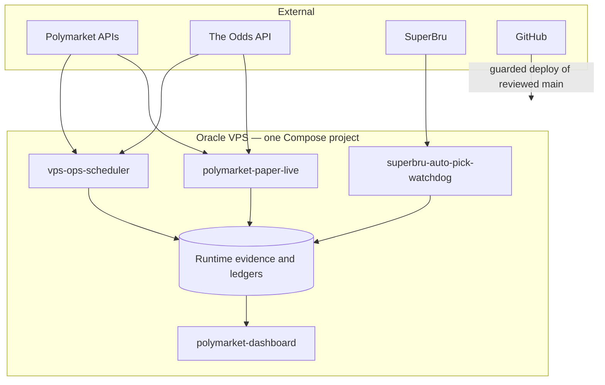

# System map

Last structurally reconciled: 2026-07-21, against merged source through PR
#354.

This document describes stable ownership and data flow. It deliberately does
not state whether the VPS is healthy, which SHA is deployed, current gate
values, evidence counts, portfolio values, quotas, or incident status. Those
facts come only from the generated operating state:

```text
/home/opc/Claude/outputs/performance/operating_state.md
/home/opc/Claude/outputs/performance/operating_state.json
```

The same report is available through the private Tailscale Serve URL stored as
`PM_DASHBOARD_PUBLIC_URL` in `/home/opc/Claude/.env`.

## Operating boundary

- All Polymarket and SuperBru runtime work and all project test execution are
  VPS-only.
- The workstation is a control surface for inspection, editing, Git/GitHub and
  SSH administration.
- One production Compose project runs from
  `docker-compose.vps-paper.yml`; duplicate writers are prohibited.
- The system remains shadow/dry-run/paper-gated. Funding is CLOSED and WO-67 is
  BLOCKED behind all registered P1-P5 preconditions.
- No autonomous live-order, signer, cancellation or credential-loading path is
  approved.
- Missing, malformed or stale control evidence is `UNKNOWN` and fails closed.

## Stable topology



## Long-running services

| Service | Stable responsibility | Important boundary |
|---|---|---|
| `polymarket-paper-live` | Continuous market collection plus paper/evidence processing | No approved live-order path |
| `polymarket-dashboard` | Renders and serves oversight evidence | Backend binds only to `127.0.0.1:8765` |
| `vps-ops-scheduler` | Serial governance refresh, collectors, proof health, maintenance and seasonal card work | One scheduler/writer; job status is evidence, not authority |
| `superbru-auto-pick-watchdog` | Checks the SuperBru pre-kickoff window and submits only under its configured controls | Separate from Polymarket funding and execution |

The one-shot `vps-deploy-acceptance` Compose profile is not a fifth
long-running service. The deploy workflow isolates the scheduler before running
that acceptance job.

## Control and deployment flow

1. A scoped branch and pull request are reviewed against the registered work
   order and engineering standards.
2. The required PR gate verifies the proposed head in the isolated ARM64/Python
   3.11 environment.
3. Accepted `main` is tied to independent-merge evidence where that control is
   required.
4. `Deploy Polymarket VPS Paper` validates the exact acceptance artifact,
   capacity, Tailscale state and rollback prerequisites before cutover.
5. The workflow updates the VPS checkout without destroying runtime roots,
   rebuilds the canonical Compose project, runs isolated acceptance, refreshes
   governance, stamps the deployed SHA and retains rollback evidence.
6. Operators read deployment acceptance and generated operating state. They do
   not infer health from a successful merge or from this document.

Ad-hoc `git pull`, manual source replacement, local Compose execution and a
second production writer are outside the operating contract.

## Evidence flow

The repository keeps forward evidence classes distinct:

```text
historical -> modeled -> reconstructed -> shadow -> paper -> live-real-money
```

An artifact may move right only through its registered prospective controls. A
later class may not be backfilled or relabelled from an earlier one.

Promotion-oriented research is frozen to:

1. sharp-anchor maker carry;
2. persistent dutch-book consistency opportunities; and
3. structural-bias/smart-flow cohorts with positive executable CLV.

Crypto up/down is an infrastructure/timing diagnostic and cannot consume
promotion-oriented modelling or capital work.

## Reporting transport

`polymarket-dashboard` publishes no supported public-IP HTTP route. Tailscale
Serve terminates authenticated tailnet-only HTTPS at:

```text
https://<node>.<tailnet>.ts.net/
```

The exact URL is written to `PM_DASHBOARD_PUBLIC_URL`. Tailscale Funnel is
forbidden. Deploy and health controls verify the loopback Docker binding, Serve
target, URL provenance and Funnel-off state.

## Authorities

| Question | Authority |
|---|---|
| What is running and healthy now? | Generated operating state and deployment evidence |
| What may an agent do? | `AGENTS.md` |
| What may be built? | `docs/POLYMARKET_CODEX_WORK_ORDERS.md` |
| What engineering controls apply? | `docs/ENGINEERING_STANDARDS.md` |
| Which research hypotheses are active? | `docs/EXPERIMENT_REGISTRY.md` |
| How is the stack deployed? | `docs/POLYMARKET_VPS_DOCKER_RUNBOOK.md` |
| How is the private dashboard exposed? | `docs/ORACLE_VPS_SETUP.md` and the Tailscale setup script |

An audit instruction is not build authority. Frozen or registered changes are
authorized only by the repository mechanism described in `AGENTS.md`; this
map neither grants funding nor authorizes a merge.

## Known audit boundary

The topology above describes intended stable ownership, not proof that every
control is fail-closed. The 2026-07-21 static audit found unresolved Funnel-off,
deploy-acceptance, SSH host-key, scheduler, timestamp, sizing and evidence-
independence gaps. In particular, do not infer private transport solely from a
successful setup script or deployment, and do not infer health from service
presence. See `docs/REPOSITORY_LINE_AUDIT_2026-07-21.md`; generated VPS evidence
remains the only point-in-time state source.
